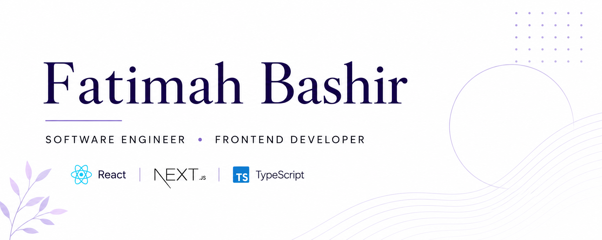

  

# Hi, I'm Fatimah Bashir 👋🏽

### Software Engineer | Frontend Developer

I’m a Software Engineering graduate and frontend developer who enjoys building clean, responsive, and user-friendly web applications.

I’m passionate about turning ideas into practical products and continuously growing through real-world projects and collaboration.

---

## 👩🏽‍💻 About Me

* 🎓 B.Sc. Software Engineering, Bayero University Kano
* 🏆 First Class Honors
* 💻 Frontend Developer
* 🌱 Currently exploring backend development and fintech
* 🤝 Open to learning, collaboration, and interesting opportunities
* 📍 Nigeria

---

## 🛠️ Tech Stack

### Frontend

`React` `Next.js` `TypeScript` `JavaScript` `Tailwind CSS` `HTML` `CSS`

### Backend & Database

`Python` `FastAPI` `Django` `PostgreSQL` `Supabase`

### Tools

`Git` `GitHub` `VS Code` `REST APIs`

---

## 🚀 Featured Project

### [Open Source Portfolio Website Generator](https://github.com/Reginah1/opensource-portfolio-website-generator)

An open-source portfolio website generator built to make it easier for developers to create their own personal portfolio websites.

**Built with:** HTML • CSS • JavaScript

---

## 🎓 Achievement

🏆 **First Class Honors**

**B.Sc. Software Engineering**
Bayero University Kano

---

## 📊 GitHub Activity

---

## 🤝 Let's Connect

I'm always happy to connect with fellow developers, collaborate on interesting projects, and learn from the community.

